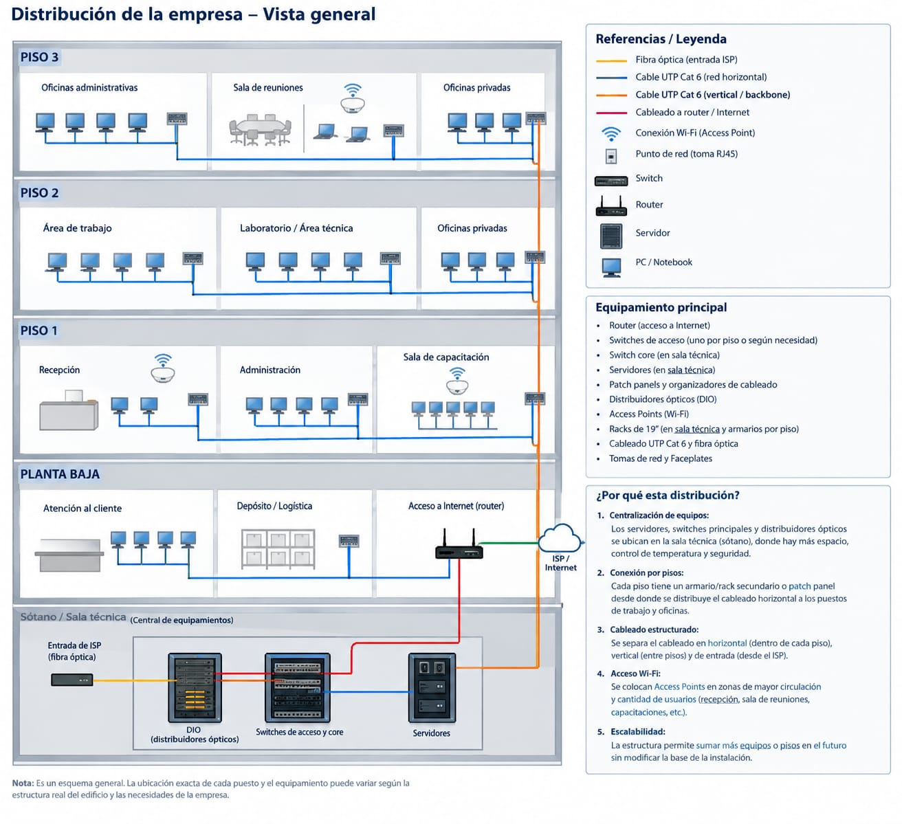

Una empresa necesita una instalación de equipos y de red con salida a Internet para 50 Puestos de Trabajo (ordenadores cliente), 20 puestos en la Zona de Planta (algunos puestos con acceso y otros sin acceso a Internet) y 4 Servidores.
● Los ordenadores cliente se encuentran distribuidos en tres niveles (10 por nivel). La Zona de Planta se encuentra en Planta Baja muy próxima al Sector de Administración.
● Los 4 servidores se encuentran en una Sala en la Planta Baja (Sala de servidores):
o Servidor proxy-DNS que da salida a Internet
o Servidor de usuarios-y-archivos
o Servidor Web
o Servidor SCADA
● Se requiere conectividad inalámbrica en todos los sectores con SSID diferenciados y con roaming automático.
● En la empresa trabajan 50 personas (usuarios)
● Cada grupo de técnicos e ingenieros comparte una base de datos de problemas y respuestas frecuentes. Los supervisores comparten entre sí diversas informaciones relacionadas con el funcionamiento global de la empresa.
1. Diseño de la red. Asigna una dirección IP, máscara de red y nombre para cada ordenador cliente y para cada servidor incluyendo el router. Representarlo en un esquema. Defi nir el tipo de cableado y los Dispositivos de Red necesarios.
2. Indicar Hardware, Sistema Operativo que instalaremos en los clientes y la confi guración de red que sea común a todos ellos. Especifi car las PCs para cada puesto de trabajo. Se recomienda defi nir un perfi l de Equipo. Por ejemplo: Ofi cina, Planta, etc.
a) Sistema operativo para los clientes:
b) Dirección IP de la puerta de salida (gateway):
c) Dirección IP del servidor DNS:
d) ¿Inicia sesión en un dominio? Indica cuál:
e) Grupo de trabajo:
3. Indica el sistema operativo que instalaremos en el servidor de usuarios y su confi guración de red.
a) Sistema operativo:
b) Dominio:
c) Dirección IP:
d) Máscara de red:
4. Indica la confi guración de red del servidor proxy-DNS.
a) Dirección IP1:
b) Máscara de red 1:
c) Dirección IP2:
d) Máscara de red 2:
e) Dirección IP de la puerta de enlace:
5. Propón una estructura de carpetas para almacenar los archivos privados de cada usuario, los de cada grupo de usuarios y los archivos públicos.
6. Indica los nombres de los grupos globales y locales que consideres oportuno crear. Muestra algún ejemplo de los elementos que agregaras (usuarios u otros grupos) dentro de cada grupo. (A los usuarios puedes darles nombres imaginarios o numerarlos: usuario01, usuario02...).
Indica los permisos de compartir para las siguientes carpetas especifi cando los miembros (usuario o grupo) y el tipo de acceso de cada permiso.
7. ¿Qué herramientas de nube utilizarías para los puntos 5 y 6?¿Cuál propondrías y por qué?
8. ¿Qué ventajas generaría que los Switch soporte VLAN? ¿Qué otra forma de separar la red en “subredes” se podría implementar?
9. ¿Qué sucedería si la planta se encuentra alejada unos 200m de la Sala de Servidores?
10. ¿Para qué recomendarías la Virtualización?
11. ¿Qué herramientas y políticas de Backup recomendarías?¿Podrías vincularlo a lo consultado en el punto 7?
12. ¿Qué utilizarías si se requiere conectar esta Sucursal con otra lejana?
13. ¿Cómo maximizamos los siguientes atributos de calidad? Disponibilidad, Seguridad, Performance, Escalabilidad.
14. Realizar mediante una Hoja de Cálculo el presupuesto de Equipamiento y Mano de Obra Completa.
15. Realizar una Propuesta Comercial para la empresa en un Documento en formato PDF

